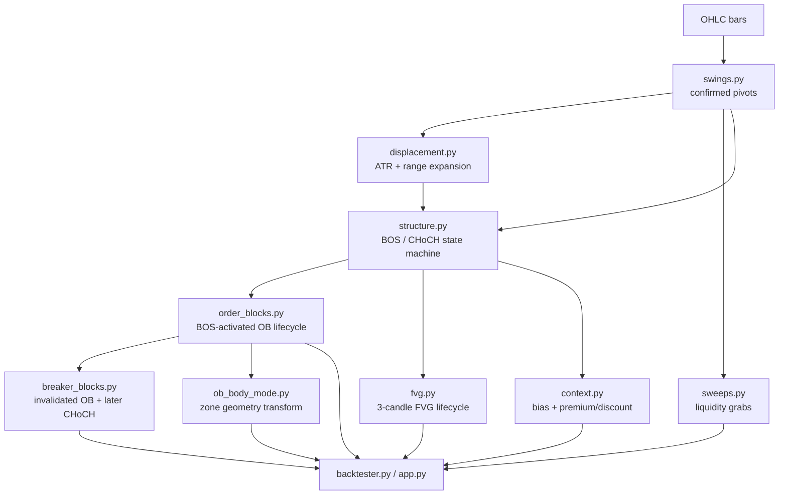
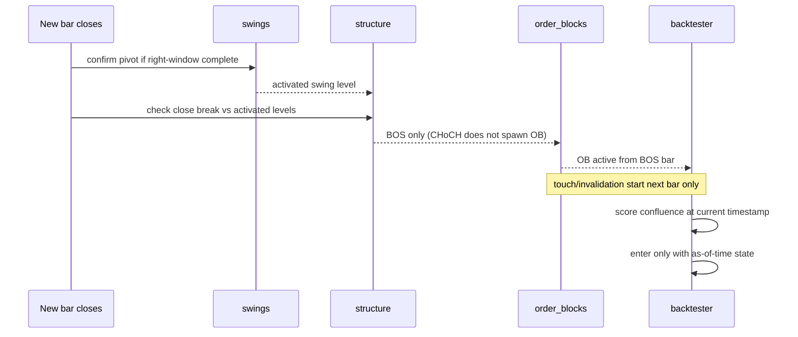

# SMC Engine Event Pipeline

## Đọc nhanh bằng tiếng Việt

Nếu thấy file này khó vì nhiều thuật ngữ, hãy hiểu ngắn như sau:

- `swings.py` tìm mốc đỉnh/đáy đủ rõ để gọi là cấu trúc
- `structure.py` quyết định đó là BOS hay CHoCH
- `order_blocks.py` chỉ sinh OB sau BOS, không sinh bừa
- `breaker_blocks.py` chỉ lấy OB đã chết rồi cho “đổi vai” nếu có CHoCH đến sau
- `context.py` biến cấu trúc thành bias + premium/discount

Ý chính của whole pipeline:

> Giá đi trước, engine chỉ đọc lại và gắn nhãn cấu trúc một cách causal.

Tại sao phải đi nhiều bước như vậy?

Vì nếu gộp hết thành “1 indicator”, bạn sẽ không biết lỗi nằm ở đâu:
- swing sai?
- BOS sai?
- OB sai?
- hay breaker promote quá sớm?

Tách pipeline ra giúp mỗi bước có test riêng và dễ audit hơn.

## Core Rule

Every event becomes visible only after the bar that confirms it closes.
That is the engine's non-negotiable invariant.

## High-Level Flow

## Step 1 — Swings

`swings.py`

Rules:

- swing high at `i`: `high[i] > max(left)` and `high[i] >= max(right)`
- swing low at `i`: `low[i] < min(left)` and `low[i] <= min(right)`
- a pivot at `i` activates at `i + right`

Output:

- `SwingEvent`
- `SwingResult.events`
- activation-aligned high/low series

## Step 2 — Displacement

`displacement.py`

Rules:

- compute causal ATR(14) with NaN warmup
- qualify range expansion when `(high - low) > multiplier * ATR`

Output:

- `ExpansionMetrics.range_atr`
- `ExpansionMetrics.body_atr`
- `ExpansionMetrics.body_ratio`
- `ExpansionMetrics.close_location`
- `ExpansionMetrics.direction`
- `ExpansionMetrics.qualified`

## Step 3 — Structure

`structure.py`

Input:

- activated swings
- optional ATR context

Decision table:

- upper break + prior trend bear => `choch bullish`
- upper break + prior trend neutral/bull => `bos bullish`
- lower break + prior trend bull => `choch bearish`
- lower break + prior trend neutral/bear => `bos bearish`

Output:

- chronological `StructureEvent`s
- index-aligned adapter series (`trend`, `bos`, `choch`, `broken_level`, ...)

## Step 4 — Sweeps

`sweeps.py`

Rules:

- bullish sweep = downside grab + reclaim close
- bearish sweep = upside grab + reject close
- one-shot per swing level

Output:

- `SweepResult.events`
- `SweepResult.diagnostics`

## Step 5 — Order Blocks

`order_blocks.py`

Rules:

- only BOS events spawn OBs
- find the last opposite candle before the break
- activate on the BOS bar
- first touch / invalidation begin from the next bar only
- expire after 200 bars
- cap active zones per direction at 128

Output:

- `OrderBlockResult.events`
- `OrderBlockEvent.is_active_at(ts)`
- `OrderBlockEvent.is_first_test_at(ts)`

## Step 6 — Fair Value Gaps

`fvg.py`

Rules:

- strict three-candle gap
- chronological touch/fill/expiry lifecycle

Output:

- `FVGResult.events`
- `FairValueGapEvent.is_active_at(ts)`
- `FairValueGapEvent.is_first_test_at(ts)`

## Step 7 — Context

`context.py`

Rules:

- convert structure trend into `bull | bear | neutral`
- classify bars against the latest structure-driven dealing range

Output:

- `ContextResult.zone`
- `ContextResult.range_low`
- `ContextResult.range_high`
- `ContextResult.equilibrium`
- `ContextResult.bias`

## Why This Pipeline Is Safe For Backtesting

## Key Invariants

- higher timeframes merge onto M15 with completed-bar semantics only
- one swing level is consumed once
- one OB origin is selected deterministically
- lifecycle queries are timestamp-safe
- extension layers never mutate the base engine when their toggles are off
