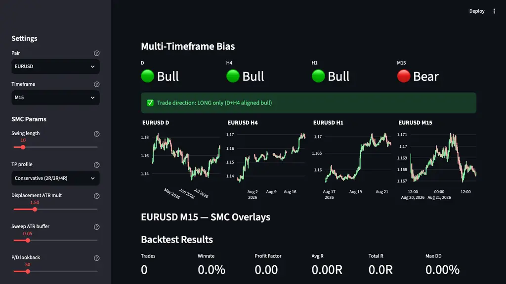
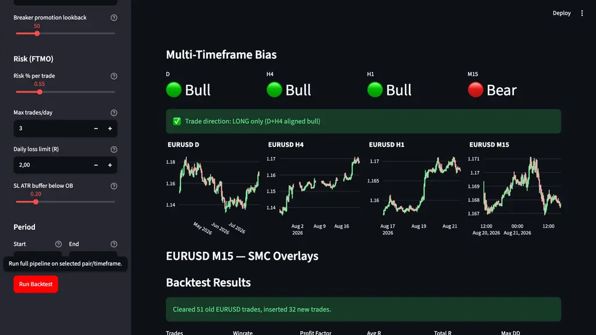

# SMC Engine Usage Guide

## Nếu bạn muốn đọc dễ hơn trước

Nếu file này vẫn còn nặng, đọc file tiếng Việt này trước:

- [SMC Engine Giải Thích Bằng Tiếng Việt](./smc-engine-vietnamese-guide.md)

Sau đó quay lại file này để xem cách dùng cụ thể trong app và backtester.

## Who This Guide Is For

Use this guide when you want to:

- run the Streamlit app and inspect structure visually
- compare `bias_mode` and `regime_mode` on backtests
- use the engine as a manual-trading reference instead of a black box
- understand which knobs matter vs which knobs are mostly geometry/sensitivity
## Main Surfaces

### 1. Streamlit app

Launch:

```bash
./run.sh
# or
PYTHONPATH=src streamlit run app.py
```

The app exposes:

- multi-timeframe bias panel
- M15 overlay chart
- backtest metrics
- filterable journal
- strategy controls for TP profile, bias mode, regime mode, and breaker lookback



### 2. Compatibility adapter

`src/smc_signals.py`

Use when you need signal overlays without touching engine internals.

```python
from src.smc_signals import SMCSignals

sig = SMCSignals(swing_length=10, displacement_atr_mult=1.5)
signals = sig.get_signals(df)                # bos / choch / fvg / ob / sweep / displacement
breakers = sig.get_breaker_overlays(df)      # additive breaker overlays
```

### 3. Backtester

`src/backtester.py`

Use when you want end-to-end metrics from the same engine that powers the UI.

```python
from src.backtester import run_backtest, compute_metrics

trades, eq = run_backtest(
    pair="EURUSD",
    config={
        "strategy": {
            "bias_mode": "strict",
            "regime_mode": "off",
            "promotion_lookback_bars": 50,
        }
    },
)
metrics = compute_metrics(trades, eq)
```

## Controls That Matter Most

### TP profile

Controls how the engine exits profitable trades.

- `Conservative (2R/3R/4R)` — current best on shipped EURUSD M15 2026 dataset
- `Balanced (3R/5R/8R)`
- `Aggressive (4R/7R/12R)`

This changes realized edge more than it changes structure detection.

### Bias mode

Controls directional filtering.

- `strict (D+H4)` — only trade when daily and H4 agree
- `h4_only` — H4 drives direction; D neutral allowed, counter-trend blocked
- `any` — loosened mode, trade when any single HTF has a bias

On shipped EURUSD M15 2026:

- `strict`: 32 trades, WR 81.2%, PF 8.29
- `h4_only`: 38 trades, WR 81.6%, PF 8.55
- `any`: 51 trades, WR 72.5%, PF 5.25

### Regime mode (breakers)

Controls how breaker overlays are consumed.

- `off` — baseline OB-classic only
- `on` — always include breaker overlays
- `auto` — derive breaker weight from regime heuristic

On shipped EURUSD M15 2026:

- `off`: 32 trades, WR 81.2%, PF 8.29
- `on`: 21 trades, WR 57.1%, PF 2.75
- `auto`: 21 trades, WR 57.1%, PF 2.75



Interpretation:

- breaker logic is implemented and tested
- default should remain `off` on this dataset
- `auto` is currently research-grade, not production-grade

### Breaker promotion lookback

Controls maximum distance between:

- OB origin position
- CHoCH position that may promote that OB into a breaker

Default: `50` bars.

Use lower values to reject stale zones.

## Controls That Matter Less On The Shipped EURUSD Dataset

These are still real engine inputs, but on the current EURUSD M15 2026 dataset
changing them did not materially change the trade set in the tested ranges:

- `swing_length`
- `displacement_atr_mult`
- `sweep_atr_buffer`
- `pd_lookback`

That is a property of the current dataset and regime, not a universal law.

## Recommended Defaults

### Baseline / safest current setup

- `TP profile = Conservative (2R/3R/4R)`
- `Bias mode = strict (D+H4)` or `h4_only`
- `Regime mode = off`
- `Breaker promotion lookback = 50`

### Research setup

- keep baseline above
- toggle `Regime mode = on` to inspect breaker behavior
- compare journal rows, not just headline metrics

### Manual-trading workflow

1. open app
2. confirm multi-timeframe bias
3. inspect M15 BOS / CHoCH / OB / sweep visually
4. treat breaker overlays as optional context, not automatic truth
5. log what the engine saw vs what you chose manually

## What Not To Do

- do not assume `auto` regime is production-ready
- do not overfit to one 8-month regime
- do not treat all breakers as high quality just because they are causal
- do not change five knobs at once and trust the headline winrate

## Read Next

- [SMC Engine Overview](./smc-engine-overview.md)
- [SMC Engine Event Pipeline](./smc-engine-event-pipeline.md)
- [SMC Engine Extensions](./smc-engine-extensions.md)
- [SMC Engine Verification](./smc-engine-verification.md)
